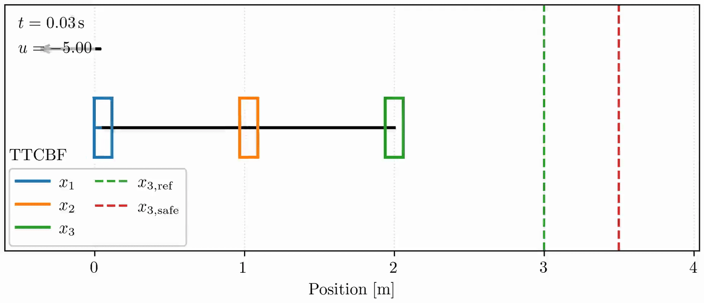
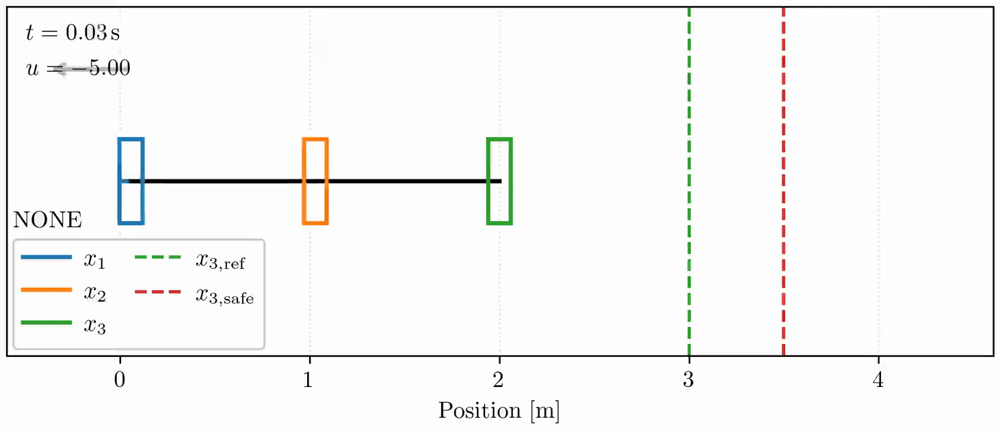
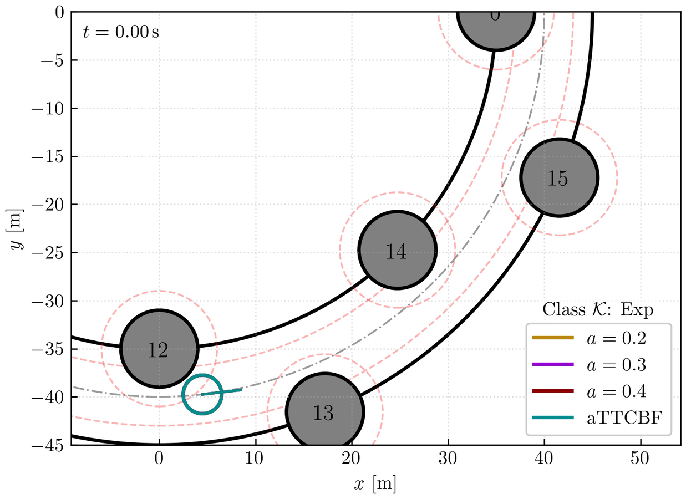
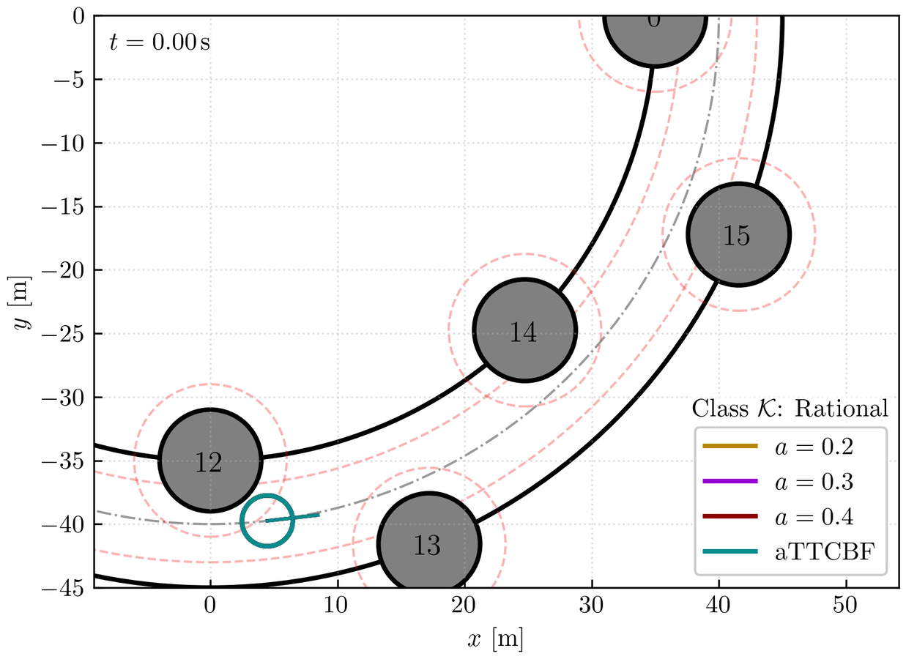
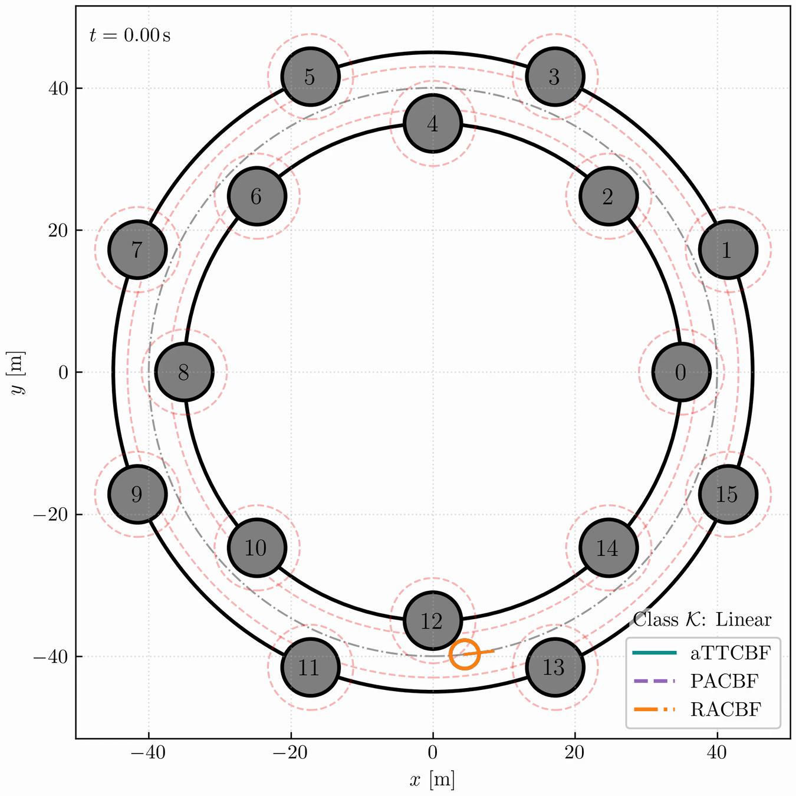

# TTCBF: A Truncated Taylor Control Barrier Function for High-Order Safety Constraints
**Abstract**: Control Barrier Functions (CBFs) provide a systematic way to enforce safety in real time by rendering a prescribed safe set forward invariant. For safety constraints with high relative degree, High-Order CBF (HOCBF) enforces safety by introducing a hierarchy of auxiliary functions together with a chain of class K functions, whose tuning effort typically grows with the relative degree. Existing adaptive variants of HOCBF further increase design complexity by introducing additional adaptive states and associated penalty weights. In this work, we introduce a new variant, termed Truncated Taylor CBF (TTCBF), that accommodates high-relative-degree safety constraints while requiring only one class K function, independent of the relative degree. We further propose an adaptive variant, adaptive TTCBF (aTTCBF), that improves feasibility with substantially fewer tuning parameters than existing adaptive HOCBFs. We validate the proposed methods through numerical experiments, including a spring-mass system with relative degree six and a corridor-navigation task with densely cluttered obstacles.

## How to Use
- For the spring-mass system, run `run_spring_mass.py`, or run `plot_spring_mass.py` directly using the saved data.
- For corridor navigation, run `run_corridor_1.py` to compare aTTCBF with TTCBF, or run `plot_corridor_1.py` directly using the saved data. Run `run_corridor_2.py` to compare aTTCBF with PACBF and RACBF, or run `plot_corridor_2.py` directly using the saved data.
  
## Simulation Videos

- Spring-Mass System: Relative Degree Six
<table>
  <tr>
    <td align="center" width="49%">
      <b>Our aTTCBF</b> 
      
    </td>
    <td align="center" width="49%">
      <b>Nominal Controller</b> 
      
    </td>
  </tr>
</table>

- Corridor Navigation: Comparing aTTCBF with TTCBF
<table>
  <tr>
    <td align="center" width="33%">
      <b>TTCBF and aTTCBF (Linear Class K)</b> 
      
    </td>
    <td align="center" width="33%">
      <b>TTCBF and aTTCBF (Exponential Class K)</b> 
      
    </td>
    <td align="center" width="33%">
      <b>TTCBF and aTTCBF (Rational Class K)</b> 
      
    </td>
  </tr>
  <!-- <tr>
    <td align="center" width="33%">
      <b>Adaptive CBFs</b> 
      
    </td>
    <td width="33%"></td>
    <td width="33%"></td>
  </tr> -->
</table>

- Corridor Navigation: Comparing Our aTTCBF with PACBF and RACBF:
<table>
  <tr>
    <td align="center">
      <b>Adaptive CBFs</b> 
      
    </td>
  </tr>
</table>
