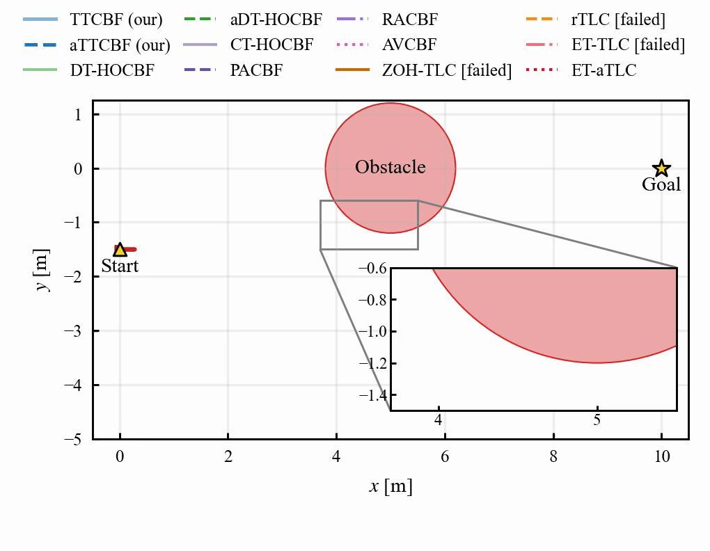
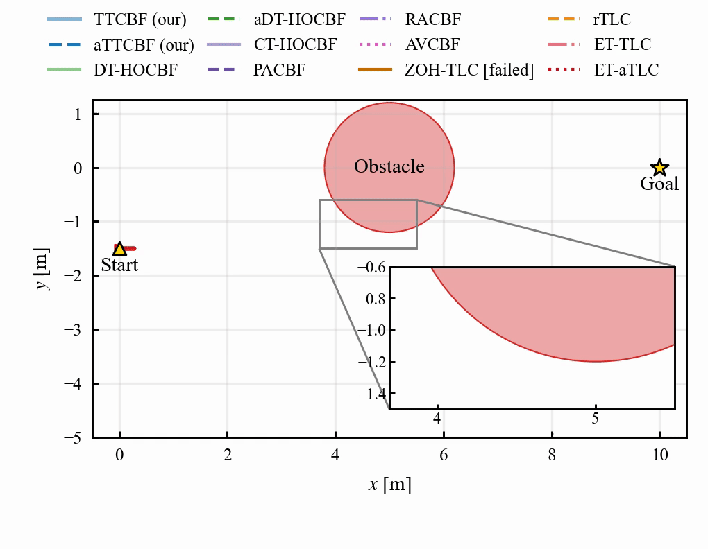

# TTCBF: A Sampled-Time Truncated Taylor Control Barrier Function for High-Order Safety Constraints

[](https://www.python.org/)
[](LICENSE)
[](https://arxiv.org/abs/2601.15196)

This repository contains the code to reproduce the simulation results in the manuscript **“TTCBF: A Sampled-Time Truncated Taylor Control Barrier Function for High-Order Safety Constraints.”** It compares the proposed Truncated Taylor Control Barrier Function (TTCBF) and adaptive TTCBF (aTTCBF) with ten baseline methods in a nonlinear static-obstacle avoidance scenario.

## Installation

The reference environment uses Python 3.11. Create an isolated Conda environment and install the pinned dependencies:

```bash
git clone https://github.com/bassamlab/ttcbf.git
cd ttcbf
conda create -n ttcbf python=3.11 -y
conda activate ttcbf
python -m pip install -r requirements.txt
```

<details>
<summary><strong>MP4 export requirements</strong></summary>

MP4 export is optional and requires [FFmpeg](https://ffmpeg.org/) on the system path:

```bash
# macOS with Homebrew
brew install ffmpeg

# Ubuntu or Debian
sudo apt-get install ffmpeg

# Windows PowerShell with WinGet
winget install --id Gyan.FFmpeg -e
```

</details>

## Reproducing the evaluation results
The manuscript results were generated on an Apple M2 Pro with 16 GB of RAM. The simulation outputs are deterministic within normal solver tolerances, but reported wall-clock runtimes depend on the hardware and current system load.

### 1. Default control bound

Run all 12 methods with the default control bounds:

```bash
python main.py
```

Results are written to `eval_results_accel_min-1/`. Under these bounds, TTCBF, aTTCBF, all recursive-chain baselines, and ET-aTLC reach the goal. ZOH-TLC, rTLC, and ET-TLC terminate because their QPs become infeasible:



### 2. Enlarged control bound

Reproduce the comparison with an enlarged deceleration bound set to `-1.5 m/s^2`:

```bash
python main.py --accel-min -1.5
```

The default output directory is `eval_results_accel_min-1.5/`.
With the enlarged braking bound of `-1.5 m/s^2`, rTLC and ET-TLC become feasible and reach the goal, while ZOH-TLC collides because it lacks a class K function that regulates the barrier decay rate:



### 3. Tightened control bounds

Reproduce the manuscript's 400 control-bound combinations for the six adaptive methods:

```bash
python main.py --grid-sweep --no-plot-figure
```

This evaluates 20 braking bounds and 20 negative yaw-rate bounds, for 2,400 rollouts in total. This can take substantially longer than the default comparison. Omit `--no-plot-figure` to additionally save a trajectory figure for every control-bound combination. 

## Number of tuning parameters

The manuscript reports the number of method-specific configurable fields used by this implementation. Each scalar field, tuple/vector field, or explicit candidate-set field listed in `TUNING_PARAMETER_FIELDS` counts once; in particular, a state-bound vector or a set of candidate prediction intervals is counted as one field rather than by its number of scalar entries. The count includes safety-constraint settings, auxiliary-dynamics initial conditions, targets, bounds and gains, associated QP cost coefficients, and configurable approximation or discretization settings.

Shared task and plant/model data (including the sampling period, control bounds, and externally specified control-rate bounds), goal-oriented nominal-controller and CLF settings, solver tolerances, and hard-coded numerical constants are excluded. Method-specific positivity floors and margins are included because they directly affect the safety or auxiliary constraints.

| Method | Count | Justification |
| --- | ---: | --- |
| TTCBF (our) | **1** | One class-K coefficient, `ttcbf_alpha`; the derived prediction interval `2 * dt` and external control-rate bounds are excluded |
| aTTCBF (our) | **1** | One QP penalty weight, `attcbf_eta_weight`, on the adaptive gain; the derived prediction interval and external control-rate bounds are excluded |
| DT-HOCBF | 2 | Two discrete-time HOCBF coefficients, `gamma1` and `gamma2` |
| aDT-HOCBF | 11 | One initial gain, two desired gains, two gain bounds, two auxiliary bound-CBF gains, one auxiliary-gain CLF rate, and three QP cost weights |
| CT-HOCBF | 2 | Two class-K coefficients, `p1` and `p2`, in the relative-degree-two HOCBF recursion |
| PACBF | 9 | One initial gain, two gain targets, one auxiliary-gain CLF rate, four QP cost coefficients, and one positivity floor |
| RACBF | 11 | Four barrier/relaxation-chain gains, two relaxation-state initial values, one target, one lower bound, one auxiliary-state CLF rate, and two QP cost weights |
| AVCBF | 9 | Four barrier/auxiliary-chain gains, two auxiliary-state initial values, one auxiliary-input target, one QP cost weight, and one positivity margin |
| ZOH-TLC | 1 | One Taylor prediction interval, `zoh_tlc_tau` |
| rTLC | 1 | One Taylor prediction interval, `rtlc_tau`; external control-rate bounds and the hard-coded sampling resolution are excluded |
| ET-TLC | 3 | One Taylor prediction interval, one four-dimensional event-box half-width vector, and one samples-per-dimension setting |
| ET-aTLC | 4 | One explicit candidate-interval set, one rollout look-ahead horizon, one four-dimensional event-box half-width vector, and one samples-per-dimension setting |

Under this counting convention, TTCBF and aTTCBF retain one tuning parameter independently of the safety constraint's relative degree. Recursive-chain-based methods require additional class-K functions as the relative degree increases. All adaptive methods, except for our aTTCBF, require more tuning parameters compared to their nonadaptive counterparts.


## Notes

<details>
<summary><strong>Experiment overview</strong></summary>

The simulated vehicle has state `[p_x, p_y, theta, v]` and control `[u_1, u_2]`, where `u_1` is yaw rate and `u_2` is acceleration. The default experiment uses:

- sampling period: `0.05 s`;
- simulation horizon: `14 s`;
- initial state: `(0, -1.5, 0, 1)`;
- goal position: `(10, 0)`;
- obstacle center and radius: `(5, 0)` and `1.0 m`;
- vehicle radius: `0.2 m`;
- yaw-rate bounds: `[-2, 2] rad/s`;
- acceleration bounds: `[-1, 1] m/s^2`.

All method implementations and parameter values used for the manuscript are self-contained in [`main.py`](main.py).

</details>

<details>
<summary><strong>Outputs and caching</strong></summary>

A standard run produces:

- `summary.csv`: rollout outcomes, safety, control, and timing metrics;
- `simulation_logs.npz`: state and control trajectories;
- `method_cache/*.npz`: reusable per-method simulation results;
- `fig_all_methods_legend.pdf`, `fig_composite_results.pdf`, `fig_cbf_h.pdf`,
  `fig_speed.pdf`, `fig_acceleration_steering_rate.pdf`,
  `fig_taylor_residuals.pdf`, and `fig_xy_trajectories.pdf`: manuscript-ready
  figures.

When `--save-video` is supplied, the run also produces `video_xy_trajectories.mp4`. The video is regenerated from the collected trajectories and is not part of the method cache.

Grid sweeps produce `grid_sweep_rollouts.csv` and `grid_sweep_method_summary.csv`. Delete an output directory or pass `--no-reuse-cache` when a completely fresh run is required. Cache compatibility accounts for shared scenario settings and method-specific parameters.

</details>

<details>
<summary><strong>Run selected methods without cached baselines</strong></summary>

Use `--methods` with `--no-reuse-cache` to simulate only selected methods:

```bash
python main.py \
  --methods ttcbf,attcbf \
  --no-reuse-cache \
  --out-dir eval_results_ttcbf_only
```

Without `--no-reuse-cache`, compatible cached baselines in the output directory are included in the comparison. Requested methods are always recomputed; missing or stale baseline caches are simulated automatically.

</details>

<details>
<summary><strong>Export a trajectory video</strong></summary>

Add `--save-video` to a single-scenario run:

```bash
python main.py --save-video
```

After simulation and cache loading are complete, the script exports `video_xy_trajectories.mp4`. The video supports fully cached, fully fresh, and mixed result sets, and uses the same trajectory styles and inset view as `fig_xy_trajectories.pdf`. Its legend is placed above the plotting frame. Each colored triangle shows vehicle heading, while the short line extending ahead of it has length proportional to speed normalized by the configured speed bounds. Video export is intentionally unavailable for grid sweeps.

</details>

<details>
<summary><strong>Override scenario or method parameters</strong></summary>

Use repeatable `--set NAME=VALUE` arguments for fields defined by `Scenario`:

```bash
python main.py \
  --methods avcbf \
  --set avcbf_k1=0.5 \
  --set avcbf_k2=0.5
```

The dedicated `--accel-min` option is equivalent to setting `accel_min` and takes precedence when both forms are supplied. Run `python main.py --help` for the complete command-line interface.

</details>

## Citation

If this repository supports your work, please cite:

```bibtex
@article{xu2026ttcbf,
  title   = {{TTCBF}: A Sampled-Time Truncated Taylor Control Barrier Function for High-Order Safety Constraints},
  author  = {Xu, Jianye and Alrifaee, Bassam},
  journal = {arXiv preprint arXiv:2601.15196},
  year    = {2026}
}
```

## License

This project is released under the [MIT License](LICENSE).
